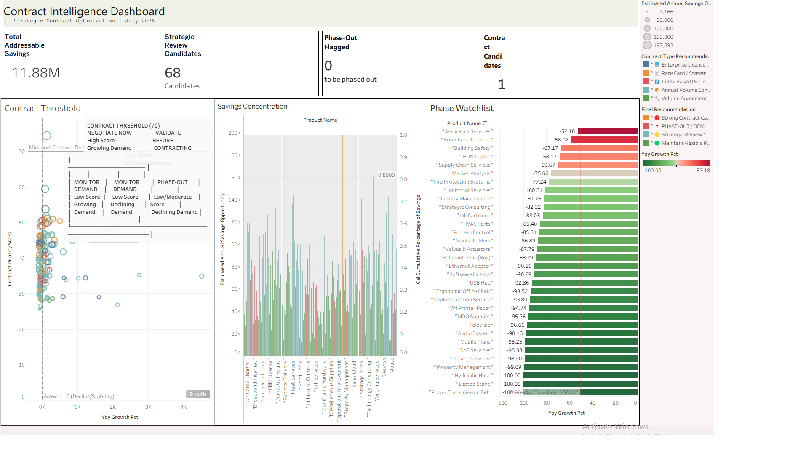

# Enterprise Procurement Intelligence Platform
**SQL • Tableau • Procurement Analytics • Business Intelligence • KPI Design • Decision Modeling**




---
Most procurement dashboards explain what happened. This platform **recommends what procurement should do next** by combining **ERP data, SQL decision models, and Tableau executive dashboards**.

---

## 🎯 Executive Impact
   Metric                     | **Value**          |
 |----------------------------|---------------------|
 | Spend Analyzed             | **$626.9M**        |
 | Suppliers Analyzed         | **88**             |
 | Invoices Analyzed          | **2,168**          |
 | Products Analyzed          | **126**            |
 | Modeled Value Opportunity   | **$4.0M+**         |

---
## 🧠 Decision Engines
 | **Engine**               | **Business Question**               | **Recommendation**               |
 |--------------------------|-------------------------------------|----------------------------------|
 | Supplier Risk            | Which suppliers create operational risk? | Retain / Monitor / Replace       |
 | Contract Intelligence    | Which products deserve contracts?   | Contract / Review / Phase-Out    |
 | Supplier Development     | Which suppliers deserve more business? | Strategic / Preferred / Approved |

---
## 🖼️ Dashboard Gallery
 | **Risk** | **Contract** | **Development** |
 |----------|--------------|-----------------|
 |  |  |  |

---
## 📈 Business Value
 | **Capability**               | **Business Outcome**                          |
 |------------------------------|-----------------------------------------------|
 | Supplier Risk Prioritization | Identify vendors requiring intervention       |
 | Contract Intelligence        | Recommend products for negotiation or phase-out|
 | Supplier Segmentation        | Improve sourcing strategy                     |
 | KPI Reporting                 | Executive visibility into spend and risk      |
 | Decision Scorecards          | Actionable recommendations (Retain/Monitor/Replace) |
 | Portfolio Optimization       | Reduce concentration risk and improve diversity |

---
## 🎯 Business Problem
Procurement teams often rely on **historical reports** rather than **actionable insights**. This platform bridges the gap by:
- Identifying **high-risk suppliers** before they disrupt operations.
- Highlighting **contract opportunities** tied to demand trends.
- Segmenting suppliers to **optimize relationships and mitigate risks**.

---
## ✨ Solution
Enterprise Procurement Intelligence Platform combines **SQL, business rules, and Tableau dashboards** to:
- Score suppliers based on **spend, error rates, and risk levels**.
- Flag **contract candidates** and **phase-out risks**.
- Deliver **executive-ready visualizations** for data-driven decisions.

---
## 🏗️ Architecture


---
## 💡 Highlights
✅ Built a **weighted supplier risk scoring model** to prioritize actions.
✅ Identified **$174.8M in suppliers requiring monitoring**.
✅ Prevented **incorrect contracting decisions** using demand trend analysis.
✅ Estimated **$4.0M+ annual value opportunities**.

---
## 🔍 SQL Preview
```sql
-- Supplier Risk Score (Spend 30% + Errors 30% + Rejections 20% + Risk 20%)
WITH cte_vendor_metrics AS (
    SELECT
        v.vendor_id,
        v.vendor_name,
        SUM(i.total) AS total_spend,
        ROUND(100.0 * SUM(CASE WHEN i.validation_status = 'Rejected' THEN 1 ELSE 0 END)
        / COUNT(i.invoice_id), 2) AS error_rate_pct
    FROM vendors_july_2026 v
    JOIN invoice_july_2026 i ON v.vendor_id = i.vendor_id
    GROUP BY v.vendor_id, v.vendor_name
)
SELECT
    vendor_name,
    total_spend,
    ROUND((total_spend / max_spend) * 30 + (error_rate_pct / 30) * 30, 2) AS vendor_risk_score

FROM cte_vendor_metrics;
Full SQL scripts available in the mysql/ directory.
```

---

## 📁 Repository Structure

```
.
├── mysql/
│   ├── case_study_1_risk_assessment.sql
│   ├── case_study_2_contract_intelligence.sql
│   └── case_study_3_supplier_development.sql
│
├── tableau/
│   └── ProcurementDashboard.twbx
│
├── docs/
│   ├── Executive_Summary.pdf
│   ├── Full_Project_Report.pdf
│   └── images/
│
├── data/
│   └── synthetic_erp_data.csv
│
└── README.md
```

---

## 🛠️ Skills Demonstrated

| **Technical**               | **Business**               |
|-----------------------------|----------------------------|
| SQL (CTEs, Window Functions) | Procurement Analytics      |
| Tableau                     | Executive Reporting        |
| Data Modeling               | KPI Design                 |
| Business Rules              | Decision Modeling          |
| ERP Data Transformation     | Data Storytelling          |

---
## 🤔 Why I Built This
Most procurement dashboards report historical KPIs. This project demonstrates how SQL, business rules, and visualization can be combined into a decision-support platform that recommends procurement actions rather than simply reporting metrics.

The goal was to simulate how an enterprise procurement analytics team might design an executive intelligence platform using synthetic ERP data.

---
## 🚀 How to Run This Project
1. Clone the repository
git clone https://github.com/yourusername/procurement-intelligence-platform.git

2. Import the SQL scripts into your MySQL database
mysql -u username -p database_name < mysql/case_study_1_risk_assessment.sql
mysql -u username -p database_name < mysql/case_study_2_contract_intelligence.sql
mysql -u username -p database_name < mysql/case_study_3_supplier_development.sql

3. Open the Tableau workbook
open tableau/ProcurementDashboard.twbx
4. Connect Tableau to your data source
5. Explore the dashboards

---

## 🤝 **Connect With Me**
Hi, I’m Oje Ebhota, a data and analytics professional. I specialize in leveraging big data, analytics, data science, machine learning, and AI automation to drive business growth and efficiency. Let’s connect to explore how we can transform your data into actionable insights!

[](https://www.linkedin.com/in/oje-ebhota-65592246/)
[](https://github.com/ojem1)
[](mailto:ojem1@yahoo.com)

---
---
## 📜 License
This project is licensed under the **MIT License** – see the [LICENSE](LICENSE) file for details.


