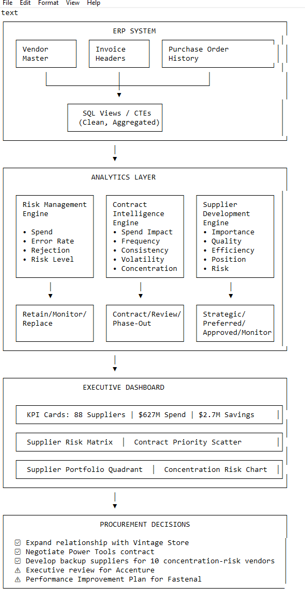

# Enterprise Procurement Intelligence Platform
**SQL • Tableau • Procurement Analytics • Executive Decision Support**


---
This project demonstrates how **SQL, business rules, and Tableau** can be combined to transform ERP procurement data into **executive decision support**. Most procurement dashboards answer *"What happened?"* — this platform answers *"What should procurement do next?"*
---

## 🎯 Executive Impact
   Metric                     | Value          |
 |----------------------------|----------------|
 | Spend Analyzed             | $626.9M        |
 | Suppliers Analyzed         | 88             |
 | Invoices Analyzed          | 2,168          |
 | Estimated Opportunities    | **$4.0M+**     |
 | Products Analyzed          | 126            |

---
## 🖼️ Dashboard Gallery

### Supplier Risk Dashboard


### Contract Intelligence Dashboard


### Supplier Development Dashboard


---
## 🎯 Business Problem
Procurement teams often rely on **historical reports** rather than **actionable insights**. This platform bridges the gap by:
- Identifying **high-risk suppliers** before they disrupt operations.
- Highlighting **contract opportunities** tied to demand trends.
- Segmenting suppliers to **optimize relationships and mitigate risks**.

---
## ✨ Solution
Enterprise Procurement Intelligence Platform combines **SQL, business rules, and Tableau dashboards** to:
- Score suppliers based on **spend, error rates, and risk levels**.
- Flag **contract candidates** and **phase-out risks**.
- Deliver **executive-ready visualizations** for data-driven decisions.

---
## 🏗️ Architecture


---
## 🔍 SQL Preview
```sql
-- Supplier Risk Score (Spend 30% + Errors 30% + Rejections 20% + Risk 20%)
WITH cte_vendor_metrics AS (
    SELECT
        v.vendor_id,
        v.vendor_name,
        SUM(i.total) AS total_spend,
        ROUND(100.0 * SUM(CASE WHEN i.validation_status = 'Rejected' THEN 1 ELSE 0 END)
        / COUNT(i.invoice_id), 2) AS error_rate_pct
    FROM vendors_july_2026 v
    JOIN invoice_july_2026 i ON v.vendor_id = i.vendor_id
    GROUP BY v.vendor_id, v.vendor_name
)
SELECT
    vendor_name,
    total_spend,
    ROUND((total_spend / max_spend) * 30 + (error_rate_pct / 30) * 30, 2) AS vendor_risk_score
FROM cte_vendor_metrics;


Full SQL scripts available in the mysql/ directory.

📁 Repository Structure
text
Copy

.
├── mysql/
│   ├── risk_engine.sql
│   ├── contract_engine.sql
│   └── supplier_engine.sql
├── tableau/
│   └── ProcurementDashboard.twbx
├── docs/
│   ├── ExecutiveSummary.pdf
│   ├── FullReport.pdf
│   └── images/
└── README.md

🛠️ Technology Stack
      Area
      Technology

    
      Data Extraction
      SQL (MySQL)
    
    
      Decision Scoring
      SQL (CTEs)
    
    
      Data Visualization
      Tableau
    
    
      Documentation
      Markdown / PDF
    
    
      Version Control
      Git / GitHub

💡 Highlights

Identified 18 suppliers requiring monitoring ($174.8M in annual spend).
Built a weighted supplier risk model using operational and financial indicators.
Implemented a demand-trend override that prevented incorrect long-term contracting decisions.
Uncovered $4.0M+ in annual value opportunities.

🎯 Why I Built This
Most procurement dashboards report historical KPIs. This project demonstrates how ERP data can be transformed into a decision-support platform that answers "What should procurement do next?" using SQL, business rules, and executive dashboards.

👤 About Me
I'm Oje Ebhota, a Senior Data & Analytics Consultant with 19+ years of enterprise technology experience specializing in:

Advanced SQL
Procurement Analytics
Tableau
Business Intelligence
AI Automation
LinkedIn | Portfolio

🔑 Key Skills Demonstrated

Advanced SQL (CTEs, Window Functions, Aggregations)
Business Intelligence
Procurement Analytics
Executive Dashboard Design
KPI Development
Decision Modeling
Risk Scoring
Contract Analytics
Data Storytelling

📜 License
This project is licensed under the MIT License – see the LICENSE file for details.
